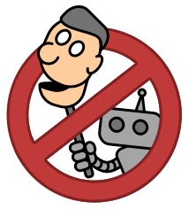

  
  
An open label for handmade digital content

# Did you make that yourself?

Tell the world by adding the **not-slop.org** logo to your work! It's not a certification or validation system. Just a fun way to show that you did your own homework.

# What is slop?

Generative AI can be very helpful. But there are important differences between human-authored content versus generative AI:

|                     | Human-authored                                                      | Generated                                                                         |
| ------------------- | ------------------------------------------------------------------- | --------------------------------------------------------------------------------- |
| **Originality**     | Each author provides a unique viewpoint                             | Generic viewpoints, even across different LLM's                                   |
| **Reputation**      | Authors have consistent credibility that can be judged from context | Hallucinations and correct outputs are mixed randomly throughout the work         |
| **Professionalism** | Writing style gives a clue to the author's diligence and expertise  | High quality and poor quality content look exactly the same                       |
| **Syndication**     | By supporting authors, we inspire them to keep creating             | What's the point of publishing generative content, if readers can simply ask GPT themselves? |

AI content becomes **slop** when it gets mixed into a catalog of human-authored content. The painstakingly created human content drowns in a sea of great-looking but generic output.

# Make a statement

Adding the **not-slop.org** logo signifies that your project was _**completely authored**_ by real people, not generative AI.

The **not-slop.org** definition allows for reasonable electronic assistance:

- **Spell checkers & grammar checkers:** Okay to use, as long as they don't alter the original meaning in any way (for example, adding additional words).
- **Thesauruses:** Okay to use, as long as they only provide wording ideas, but do _not_ choose words for you.
- **AI research tools:** While writing your content, it's okay for the human to ask questions or perform searches using an AI agent, provided the result is typed by hand, _not_ copy & pasted from a chatbot.
- **AI proofreading:** You can ask AI to look for mistakes or awkward language, as long as the fixes are not automatically applied. (Acceptable: _"Can you find any typos in this paragraph? List them."_ Unacceptable: _"Rewrite this paragraph to fix any mistakes."_)
- **AI translation services:** It's okay to translate your human-authored document into foreign languages, but you should ask a native speaker to review it.
- **Quoted AI excerpts:** For example, if you're writing an article about an AI chatbot, you can include transcripts of chats, as along as they're clearly separated from the main text.

# Where can I use it?

The **not-slop.org** logo can be applied to:

- web pages
- books
- documents
- GitHub repositories
- software applications

# Questions and feedback

Did you use the logo?  Have a question or idea?

- Tell us using [GitHub discussions](https://github.com/not-slop/website/discussions)

Found a mistake?  Want to propose an improvement?

- Create a [GitHub issue](https://github.com/not-slop/website/issues) or [pull request](https://github.com/not-slop/website/pulls)
